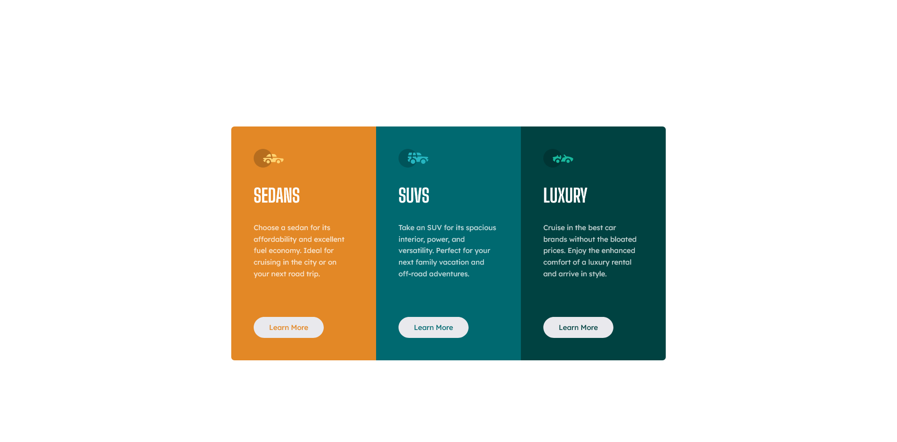
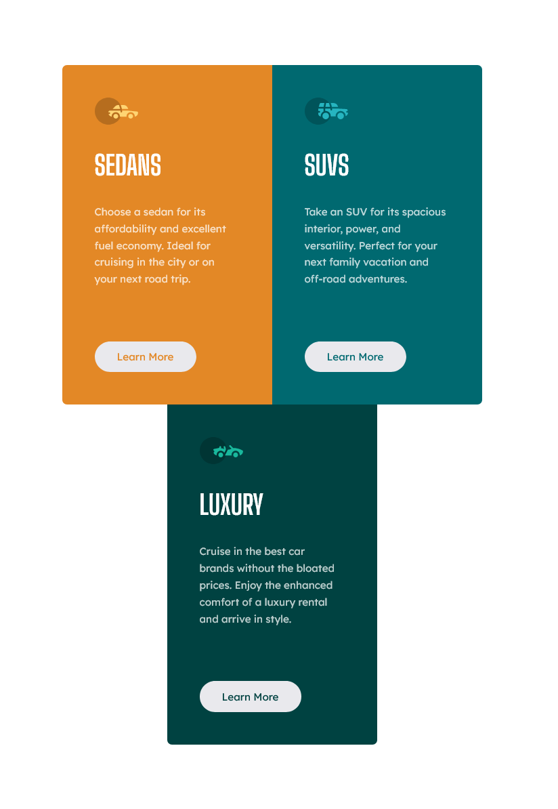
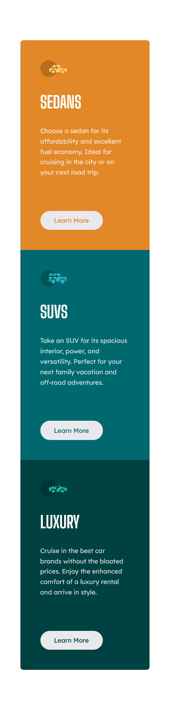

# Frontend Mentor - 3-column preview card component solution

This is a solution to the [3-column preview card component challenge on Frontend Mentor](https://www.frontendmentor.io/challenges/3column-preview-card-component-pH92eAR2-).
Frontend Mentor challenges help you improve your coding skills by building realistic projects. 

## Table of contents

- [Overview](#overview)
  - [The challenge](#the-challenge)
  - [Screenshot](#screenshot)
  - [Links](#links)
- [My process](#my-process)
  - [Built with](#built-with)
  - [What I learned](#what-i-learned)
- [Author](#author)

**Note: Delete this note and update the table of contents based on what sections you keep.**

## Overview

### The challenge

Users should be able to:

- View the optimal layout depending on their device's screen size
- See hover states for interactive elements

### Screenshot







### Links

- Solution URL: [Add solution URL here](https://github.com/totarochristian/3-column-preview-card-component)
- Live Site URL: [Add live site URL here](https://3-column-preview-card-component-mchchefy8-totarochristian.vercel.app)

## My process

### Built with

- Semantic HTML5 markup
- CSS custom properties
- Flexbox
- Media Queries

### What I learned

Use of media queries to change the style of elements based on the screen size.

```css
@media screen and (max-width: 978px) {
    .container .elem:first-child{
        border-radius: var(--br-elements) 0 0 var(--br-elements);
    }
    .container .elem:nth-child(2){
        border-radius: 0 var(--br-elements) var(--br-elements) 0;
    }
    .container .elem:last-child{
        border-radius: 0 0 var(--br-elements) var(--br-elements);
    }
}
```

## Author

- GitHub - [@totarochristian](https://github.com/totarochristian)
- Frontend Mentor - [@totarochristian](https://www.frontendmentor.io/profile/totarochristian)